# SMS业务梳理

# 1.Code结构

1. js文件夹(主要的业务逻辑处理代码)
2. style文件夹(主要的SMS所使用的css文件)
3. index.html文件(SMS目前为止唯一的渲染与展示的页面，即SMS所有呈现给用户的展示均由此html文件提供)
4. manifest.webapp文件
   1. 对应用的描述和说明
   2. 需要请求的权限
   3. 处理其他应用调用其资源的activity请求
   4. etc.

5. others(提供国际化，音频与认证的信息)

# 2.SMS项目流程

# 3.SMS业务组织结构

# 4.分层简介

## 4.1 index.html

​    SMS唯一的入口index.html页面，承载SMS中new,options等相关的所有页面的呈现，是页面的主入口，可以

理解为SMS唯一的展示页面，

## 4.2 js folder(只有部分)

​    JavaScript代码均采用自执行函数编写，用`"use strict"`严格模式编写，消除代码的不合理不严谨之处，保证代码运行安全，增加运行速度，为新版本JavaScript做好铺垫

点击message->进入index页面->初始化渲染一个相当于loading页面->开始进入startup.js->加载最先依赖的js如(thread_list_ui.js,settings.js(用以渲染主界面，并且读取信息数量以及草稿并定位到第一个草稿或信息，此主要功能和方法调用均在thread_list_ui.js文件中))

thread_list_ui.js进行首先展示页面的初始化，如渲染新建，设置选项，并在此js中初始化各个按键选项，以备之后的各种点击事件的响应与判定

1. **新建信息** thread_list_ui.js -> thread_ui.js(添加自定义监听事件) -> thread_list_ui.js -> navigation.js(请求入栈) -> thread_list_ui.js(beforeLeave) -> navigation_map.js ->

   ​    目前跟踪代码，牵扯到四个js文件，thread_list_ui.js中主要进行新建界面的渲染并将光标focus到联系人input框输入，在点击新建时，启动skNewMessage的method，调用toPanel函数，创建一个新的信息面板承载信息输入，slide滑入新的面板界面，画出新建界面，走完skNewMessage中的方法时还未获取焦点，进入handleEvent函数进行聚焦与剩余元素的显示.

2. **草稿显示**

   信息或草稿的拼接在appendThread与createThread(此函数进行新建元素的属性与dom拼接)函数中

3. **从新建信息处按backspace**

   promise = promise.then(
   ​        this.slide.bind(this, nextPanelInfo.wrapperPosition),nextPanelInfo.wrapperPosition标识为"right"，在退回主页面之后，与进入message方式相同，获得draft的信息，在appendThread与createThread(此函数进行新建元素的属性与dom拼接)函数中拼接和渲染

# 结语

​	业务总结的很差，只总结出了一个sms组织结构图，仅仅只是功能点，有像**设置**等选项还未整理出来，只是将新建信息，草稿和回退这部分简单总结，代码牵扯的函数挺多的，有些函数的场景目前还没理解透.

​	同时，我了解自身对目前业务生疏的情况，但还是希望尽快在项目上入手，更方便自己对业务的透彻理解，后边也会在工作中加强业务代码的理解，**陆续输出自己处理工作的文档**，谢谢。